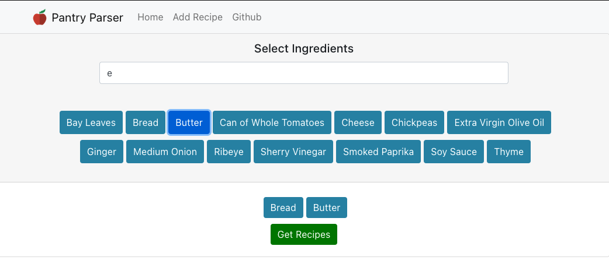

# PantryParser
Web application allowing users to get a list of recipes based on the ingredients they have on hand

Backend provided by [PantryParserAPI](https://github.com/Issier/PantryParserAPI)

## Landing Page

## Recipe Result

## Recipe Description

